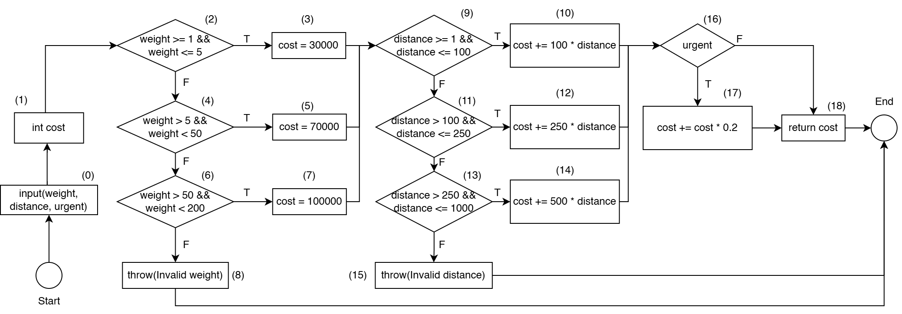

# Kiểm thử và đảm bảo chất lượng phân mềm
## Bài toán
Tính phí giao hàng (làm tròn đến phần nguyên) dựa trên trọng lượng gói hàng, khoảng cách vận
chuyển, và loại hình giao hàng có phải hỏa tốc hay không.

- Đầu vào: trọng lượng gói hàng (kg), khoảng cách vận chuyển (km), hỏa tốc (có hay không)
    - weight: int, 1 ≤ weight ≤ 200
    - distance: int, 1 ≤ distance ≤ 1000
    - urgent: bool
- Đầu ra: phí giao hàng (đã làm tròn đến phần nguyên)
    - Công thức tính phí: 
        - Phí cơ bản:
            - Nếu 1 ≤ weight ≤ 5: 30000
            - Nếu 5 < weight ≤ 50: 70000
            - Nếu 50 < weight ≤ 200: 100000
        - Phụ phí theo khoảng cách:
            - Nếu 1 ≤ distance ≤ 100: 100/km
            - Nếu 100 < distance ≤ 250: 250/km
            - Nếu 250 < distance ≤ 1000: 500/km
        - Phụ phí hỏa tốc: 20% tổng phí cơ bản và phụ phí theo khoảng cách
    - Trường hợp đầu vào không hợp lệ, trả về exception 
        - Invalid weight
        - Invalid distance

## Mã nguồn
```java
public int calculateShippingCost(int weight, int distance, boolean urgent) {
    int cost;

    if (weight >= 1 && weight <= 5) {
        cost = 30000;
    } else if (weight > 5 && weight < 50) { // BUG: điều kiện sai, nên dùng weight <= 50
        cost = 70000;
    } else if (weight > 50 && weight <= 200) {
        cost = 100000;
    } else {
        throw new IllegalArgumentException("Invalid weight");
    }

    if (distance >= 1 && distance <= 100) {
        cost += 100 * distance;
    } else if (distance > 100 && distance <= 250) {
        cost += 250 * distance;
    } else if (distance > 250 && distance <= 1000) {
        cost += 500 * distance;
    } else {
        throw new IllegalArgumentException("Invalid distance");
    }

    if (urgent) {
        cost += (int) (cost * 0.2);
    }

    return cost;
}
```

## Kiểm thử dòng điều khiển (C2)

Đồ thị dòng điều khiển CFG với độ đo C2 là:

Ta xây dựng bảng với các đường đi cùng các ca kiểm thử tương ứng:

| ID  | Path                                               | Input                  | Actual Output   | Expected Output  | Result |
|-----|----------------------------------------------------|------------------------|-----------------|------------------|--------|
| TC1 | 1,2(T),3,9(T),10,16(F),18                           | 3, 50, false           | 35000           | 35000            | Passed |
| TC2 | 1,2(F),4(T),5,9(F),11(T),12,16(F),18                 | 10, 150, false         | 107500          | 107500           | Passed |
| TC3 | 1,2(F),4(F),6(T),7,9(F),11(F),13(T),14,16(T),17,18   | 100, 500, true         | 420000          | 420000           | Passed |
| TC4 | 1,2(F),4(F),6(F),8                                  | 250, 150, false        | Invalid weight  | Invalid weight   | Passed |
| TC5 | 1,2(T),3,9(F),11(F),13(F),15                         | 3, 1200, false         | Invalid distance| Invalid distance | Passed |

Chạy test cases:
```java
import junit.framework.TestCase;

public class ShippingCostCalculatorC2Test extends TestCase {
    public void test1() {
        ShippingCostCalculator calculator = new ShippingCostCalculator(3, 50, false);
        assertEquals(30000 + 100 * 50, calculator.calculateShippingCost());
    }

    public void test2() {
        ShippingCostCalculator calculator = new ShippingCostCalculator(10, 150, false);
        assertEquals(70000 + 250 * 150, calculator.calculateShippingCost());
    }

    public void test3() {
        ShippingCostCalculator calculator = new ShippingCostCalculator(100, 500, true);
        assertEquals((int) ((100000 + 500 * 500) * 1.2), calculator.calculateShippingCost());
    }

    public void test4() {
        ShippingCostCalculator calculator = new ShippingCostCalculator(250, 150, false);
        try {
            calculator.calculateShippingCost();
            fail("Expected an IllegalArgumentException to be thrown");
        } catch (IllegalArgumentException e) {
            assertEquals("Invalid weight", e.getMessage());
        }
    }

    public void test5() {
        ShippingCostCalculator calculator = new ShippingCostCalculator(3, 1200, false);
        try {
            calculator.calculateShippingCost();
            fail("Expected an IllegalArgumentException to be thrown");
        } catch (IllegalArgumentException e) {
            assertEquals("Invalid distance", e.getMessage());
        }
    }
}

```
Nhận thấy rằng, tất cả các test cho độ đo C2 đều Passed, tuy vậy bộ test không phát hiện được bug cài ở dòng 6. Cần sử dụng các phương pháp kiểm thử khác, ví dụ kết hợp giữa phân hoạch tương đương và kiểm thử biên để có thể phát hiện được lỗi này.